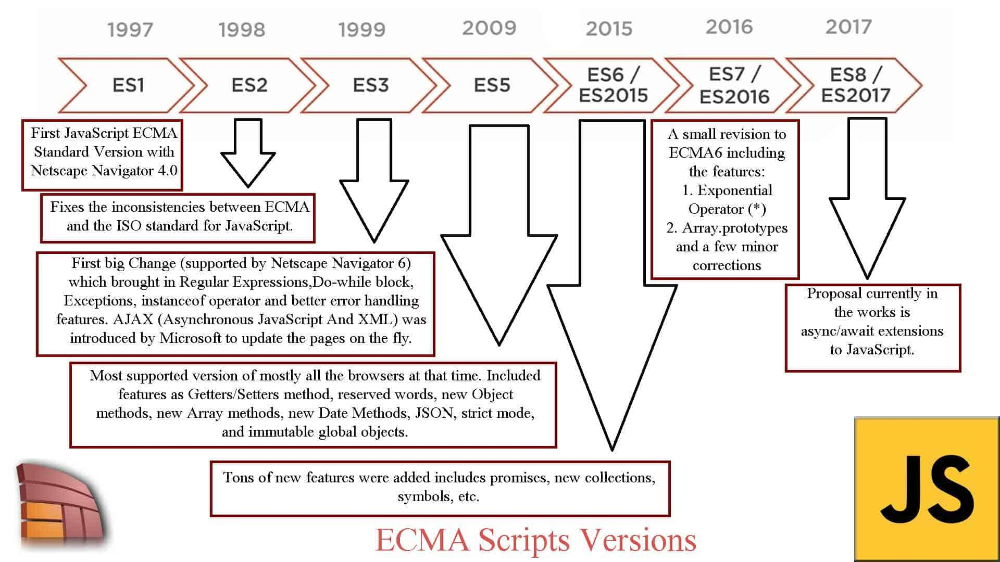
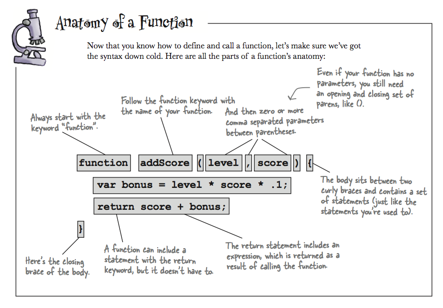

# Javascript

## What is JAVASCRIPT?
### JavaScript - это язык написания сценариев или программирования, который позволяет реализовывать сложные функции на веб—страницах - каждый раз, когда веб-страница делает нечто большее, чем просто сидит там и отображает статическую информацию для вашего просмотра — отображение своевременных обновлений контента, интерактивных карт, анимированной 2D / 3D графики, прокручивающихся музыкальных автоматов и т.д. — Вы можете поспорить, что, вероятно, задействован JavaScript. Это третий слой слоеного пирога стандартных веб-технологий, две из которых (HTML и CSS) мы рассмотрели гораздо более подробно в других разделах учебной области.
## Javascript is for what?

## Features of Javascript

## Javascript uses in many other areas

## The role of javascript in web development

## A brief history of javascript

### Брендан Эйх впервые разработал JavaScript, компьютерный язык, примерно за десять дней в мае 1995 года. Язык, ранее известный как Mocha, позже модифицированный в LiveScript, а теперь известный просто как JavaScript, был создан для использования на клиентской стороне веб-сайтов, позволяя добавлять динамические и интерактивные компоненты к статическим HTML текстам.
### JavaScript изначально был реализован в Netscape Navigator, который в то время был самым популярным браузером. Этот язык был быстро принят Microsoft для использования в Internet Explorer. Благодаря своей простоте использования и тому факту, что это был единственный доступный в то время клиентский скриптовый язык, JavaScript быстро завоевал популярность среди веб-разработчиков.
### В последующие годы JavaScript приобрел популярность и использовался для разработки широкого спектра веб-приложений, таких как онлайн-игры, динамические меню и проверка формы. ECMAScript 4, новая версия языка, планировалась в 2002 году, однако в конечном итоге от нее отказались из-за конфликтов между различными производителями браузеров.
### По оценкам, 95% веб-сайтов используют его в том или ином качестве, JavaScript в настоящее время является одним из самых популярных языков программирования, используемых во всем мире. Он используется не только в веб-разработке, но и при создании серверных приложений, настольных и мобильных приложений и даже при программировании роботов и другого оборудования.
### С момента своего первого выпуска в 1995 году язык JavaScript претерпел ряд изменений, каждое из которых привносило новые функции и синтаксис. В этом ответе мы сравним некоторый код из более старой версии с кодом из самого последнего обновления.

### Пример 1: Ключевое слово var впервые стало доступно в первоначальном выпуске JavaScript 1995 года. Объявление переменной, которая впоследствии может быть изменена в коде, выполняется с его помощью. Переменные в JavaScript должны были объявляться с использованием ключевого слова let, которое было взято из языка программирования C до появления var.

### Два новых ключевых слова, let и const, были добавлены в ECMAScript 6 (который был выпущен в 2015 году), чтобы предоставить переменные области видимости блока в дополнение к переменным области видимости функции, предлагаемым var. Ключевое слово let, разрешающее переназначение переменных, сравнимо с var в том смысле, что оно также предлагает определение области действия блока. С другой стороны, переменные, значения которых нельзя изменить, объявляются с помощью ключевого слова const .

## Javascripts variables

## Primitives and Objects

## Operators in Javascript
](imag/Operators_In_JavaScript_10.webp)

## Conditions

## Loops

## Function Review: Anatomy of a function
